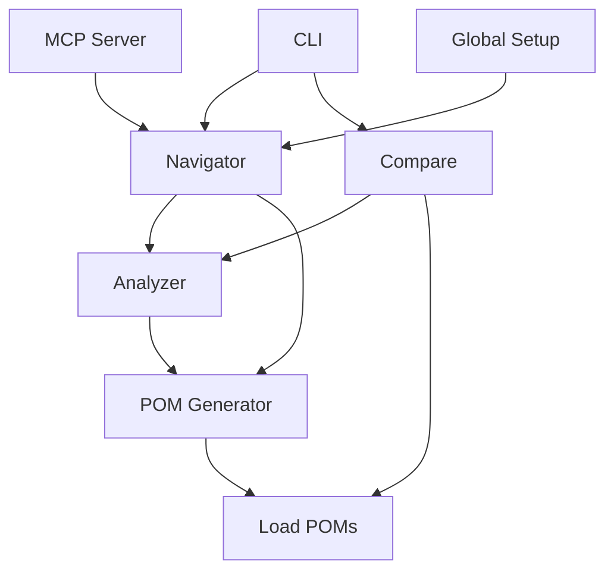

# Architecture Overview

The MCP POM Generator is a sophisticated tool designed to analyze web applications and generate Page Object Models (POMs) automatically. This document provides a high-level overview of the system's architecture and component interactions.

## System Components

### Core Components

1. **Analyzer (`analyzer.ts`)**
   - Analyzes web pages to identify UI elements and their properties
   - Detects element types, attributes, and relationships
   - Generates structured data about page elements
   - Used by both POM Generator and Compare modules

2. **POM Generator (`pomGenerator.ts`)**
   - Creates Page Object Models based on analyzer output
   - Generates TypeScript classes for each page
   - Implements element selectors and interaction methods
   - Maintains page hierarchy and relationships

3. **Navigator (`navigator.ts`)**
   - Handles page navigation and crawling
   - Uses Analyzer to understand page structure
   - Interacts with POM Generator to create models
   - Manages browser context and state

4. **Compare (`compare.ts`)**
   - Compares different versions of POMs
   - Uses Analyzer to detect changes
   - Loads and analyzes existing POMs
   - Generates comparison reports

5. **CLI (`cli.ts`)**
   - Command-line interface for the tool
   - Handles user commands and options
   - Coordinates between different components
   - Provides user feedback and progress updates

6. **MCP Server (`mcpServer.ts`)**
   - Web server component for remote operations
   - Uses Navigator for page analysis
   - Provides API endpoints for POM generation
   - Handles concurrent requests

7. **Global Setup (`global.setup.ts`)**
   - Manages authentication and session state
   - Handles login procedures
   - Maintains browser context
   - Integrates with Playwright configuration

## Component Interactions



### Interaction Flow

1. **Initialization**
   - CLI or MCP Server receives request
   - Global Setup establishes authenticated session
   - Navigator initializes browser context

2. **Page Analysis**
   - Navigator loads target pages
   - Analyzer processes page elements
   - POM Generator creates models
   - Results stored or returned to client

3. **Comparison Process**
   - Compare module loads existing POMs
   - Analyzer processes new page state
   - Differences identified and reported

## Data Flow

1. **Page Analysis Flow**
   ```
   Browser Page -> Navigator -> Analyzer -> POM Generator -> TypeScript Files
   ```

2. **Comparison Flow**
   ```
   Existing POMs -> Compare -> Analyzer -> Difference Report
   ```

3. **Server Flow**
   ```
   API Request -> MCP Server -> Navigator -> Response
   ```

## Key Features

1. **Modular Design**
   - Components are loosely coupled
   - Easy to extend and modify
   - Clear separation of concerns

2. **Extensible Architecture**
   - New analyzers can be added
   - Custom POM generators supported
   - Flexible comparison strategies

3. **Scalable Implementation**
   - Server supports concurrent operations
   - Efficient resource management
   - Configurable performance parameters

## Security Considerations

1. **Authentication**
   - Handled by Global Setup
   - Secure credential management
   - Session state persistence

2. **Data Protection**
   - Sensitive data isolation
   - Secure file handling
   - Environment variable usage

## Performance Optimization

1. **Resource Management**
   - Efficient browser context handling
   - Memory usage optimization
   - Concurrent operation support

2. **Caching Strategies**
   - Session state caching
   - Analyzer result caching
   - POM comparison caching

## Error Handling

1. **Component-Level**
   - Each module handles its own errors
   - Graceful degradation
   - Detailed error reporting

2. **System-Level**
   - Global error handling
   - Recovery mechanisms
   - User notification system 