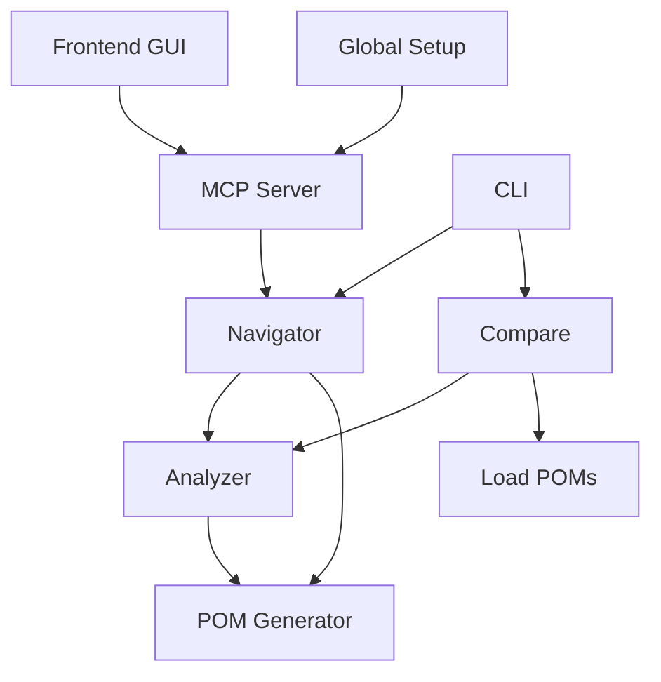

# Architecture Overview

The MCP POM Generator is a sophisticated tool designed to analyze web applications and generate Page Object Models (POMs) automatically. This document provides a high-level overview of the system's architecture and component interactions.

## System Components

### Core Components

1. **Analyzer (`src/analyzer.ts`)**
   - Analyzes web pages to identify UI elements and their properties
   - Detects element types, attributes, and relationships
   - Generates structured data about page elements
   - Used by both POM Generator and Compare modules

2. **POM Generator (`src/pomGenerator.ts`)**
   - Creates Page Object Models based on analyzer output
   - Generates TypeScript classes for each page
   - Implements element selectors and interaction methods
   - Maintains page hierarchy and relationships

3. **Navigator (`src/navigator.ts`)**
   - Handles page navigation and crawling
   - Uses Analyzer to understand page structure
   - Interacts with POM Generator to create models
   - Manages browser context and state

4. **Compare (`src/compare.ts`)**
   - Compares different versions of POMs
   - Uses Analyzer to detect changes
   - Loads and analyzes existing POMs
   - Generates comparison reports

5. **CLI (`src/cli.ts`)**
   - Command-line interface for direct tool usage
   - Provides analyze and crawl commands
   - Interacts with Navigator component

6. **MCP Server (`src/mcpServer.ts`)**
   - Express.js server providing REST API
   - Endpoints for analysis and crawling
   - Bridges Frontend GUI with Navigator

7. **Global Setup (`src/global.setup.ts`)**
   - Handles authentication setup
   - Manages session state
   - Supports authenticated page analysis

8. **Frontend GUI (`mcp-frontend/`)**
   - User interface built with React and TypeScript
   - Interacts with the MCP Server API
   - Provides a visual way to trigger analysis/crawls and view results
   - Modern, responsive design with Tailwind CSS

## Component Interactions

### Interaction Flow

1. **Initialization**
   - CLI or MCP Server receives request
   - Global Setup establishes authenticated session
   - Navigator initializes browser context

2. **Page Analysis**
   - Navigator loads target pages
   - Analyzer processes page elements
   - POM Generator creates models
   - Results stored or returned to client

3. **Comparison Process**
   - Compare module loads existing POMs
   - Analyzer processes new page state
   - Differences identified and reported

## Data Flow

1. **CLI Flow**
   User Command -> CLI -> Navigator -> Analyzer -> POM Generator -> File System

2. **Server API Flow**
   HTTP Request -> MCP Server -> Navigator -> Analyzer -> POM Generator -> Response

3. **Compare Flow**
   Compare Command -> Load POM -> Navigator -> Analyzer -> Validation Results

4. **GUI Interaction Flow**
   User Action (GUI) -> Frontend GUI -> API Request -> MCP Server -> Navigator -> Response -> Frontend GUI -> Display Results

## Key Features

1. **Modular Design**
   - Components are loosely coupled
   - Easy to extend and modify
   - Clear separation of concerns

2. **Extensible Architecture**
   - New analyzers can be added
   - Custom POM generators supported
   - Flexible comparison strategies

3. **Scalable Implementation**
   - Server supports concurrent operations
   - Efficient resource management
   - Configurable performance parameters

## Security Considerations

1. **Authentication**
   - Handled by Global Setup
   - Secure credential management
   - Session state persistence

2. **Data Protection**
   - Sensitive data isolation
   - Secure file handling
   - Environment variable usage

## Performance Optimization

1. **Resource Management**
   - Efficient browser context handling
   - Memory usage optimization
   - Concurrent operation support

2. **Caching Strategies**
   - Session state caching
   - Analyzer result caching
   - POM comparison caching

## Error Handling

1. **Component-Level**
   - Each module handles its own errors
   - Graceful degradation
   - Detailed error reporting

2. **System-Level**
   - Global error handling
   - Recovery mechanisms
   - User notification system

## Key Design Decisions

1. **Modular Architecture**
   - Components are loosely coupled
   - Each module has a single responsibility
   - Easy to extend or modify individual parts

2. **Multiple Interfaces**
   - GUI for user-friendly operation
   - CLI for automation/scripts
   - Server API for integration

3. **Session Management**
   - Separate authentication setup
   - Reusable session state
   - Secure credential handling

4. **Code Generation**
   - TypeScript for type safety
   - Maintainable POM structure
   - Best practices enforcement

## Future Considerations

1. **Scalability**
   - Parallel crawling support
   - Distributed analysis
   - Performance optimization

2. **Integration**
   - CI/CD pipeline integration
   - Test framework plugins
   - Additional output formats

3. **Enhancement**
   - AI-powered selector optimization
   - Visual regression testing
   - Extended page analysis 